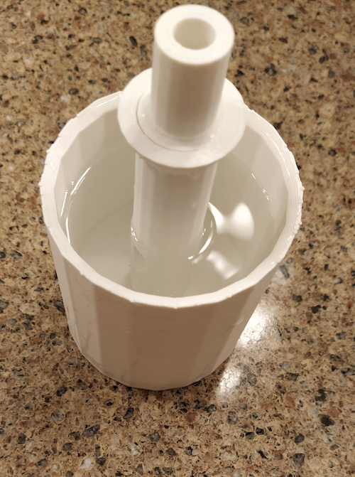
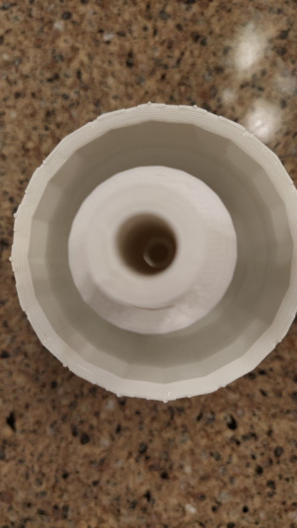
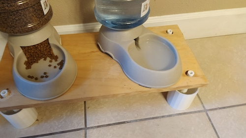
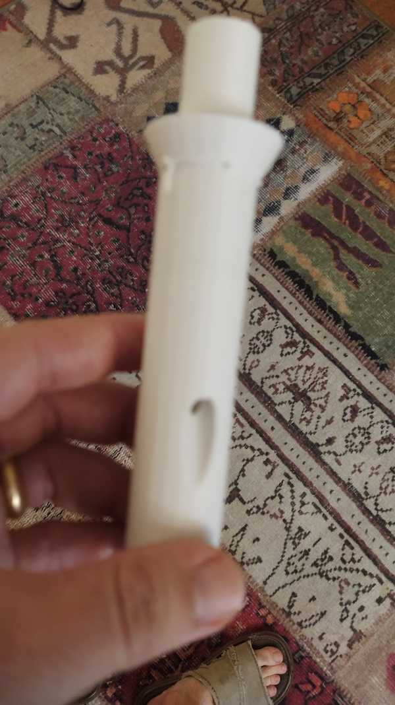

# Pet food table ant water barrier legs

Do you have some impossible to get rid of ants that like to get to your pet food? You might have problems, but ants have the problem of not being able to swim. 

This is a leg that has a cup built around it so you can fill it with water so the ant can't climb up the leg. Take a board that is big enough to hold your pet food (and possibly your pet) drill 4 holes in it and insert the legs underneath. 

The legs also have a hole down the center and a funnel you can slide in to fill them with water without having to take the legs out of the table. 

## Printing:

High accuracy isn't needed here, and I used a .6 nozzle and in Cura I put the quality profile as "draft 0.32" with PLA. This made the print time way lower, and a wider nozzle makes a stronger print. Infill was 20%.

The semi-circles are intended to help you see where the surface of the water is, and are best printed in a darker color then the leg (which should printed in light color for visibility). They did fail to float though, and perhaps a 0% infill would work better. If that works for you, leave a comment. 

## Assembly: 

* Print at least 4 legs (more if you use a larger board)
* Drill holes 45mm from each corner. This will allow you to be able to see into the cup without food falling into the cup. Holes should be 3/4 inch, though after printing I realized I only had 1 inch drill bits, but as you can see in the second picture, 1 inch works fine due to the flare out under where the hole goes. 
* The cups hold 200 ml of water, or roughly 3/4 a cup. This looks like it might help:
https://www.thingiverse.com/thing:36980

## Possible improvements:

* Some caps for the holes
* Bigger funnel (maybe just the size to fill the cup)
* Better floating rings (bigger so more space inside)

